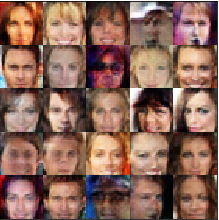

# Udacity Deep Learning Foundations Nanodegree

## Project 5: Face Generation

Using generative adversarial networks to generate new images of faces.

[FloydHub](https://www.floydhub.com) GPUs used for training.

### Sample of Output:

